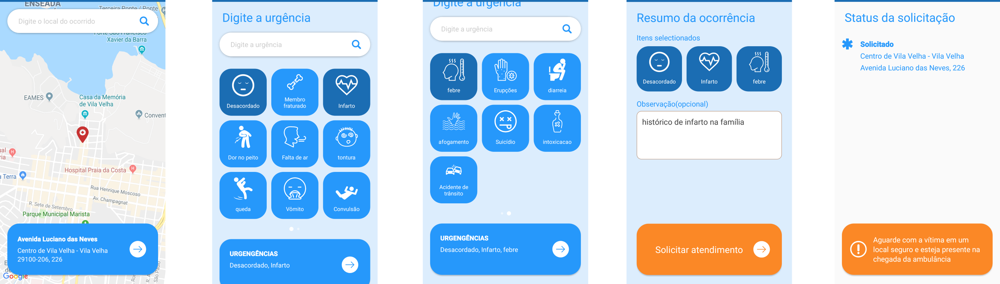
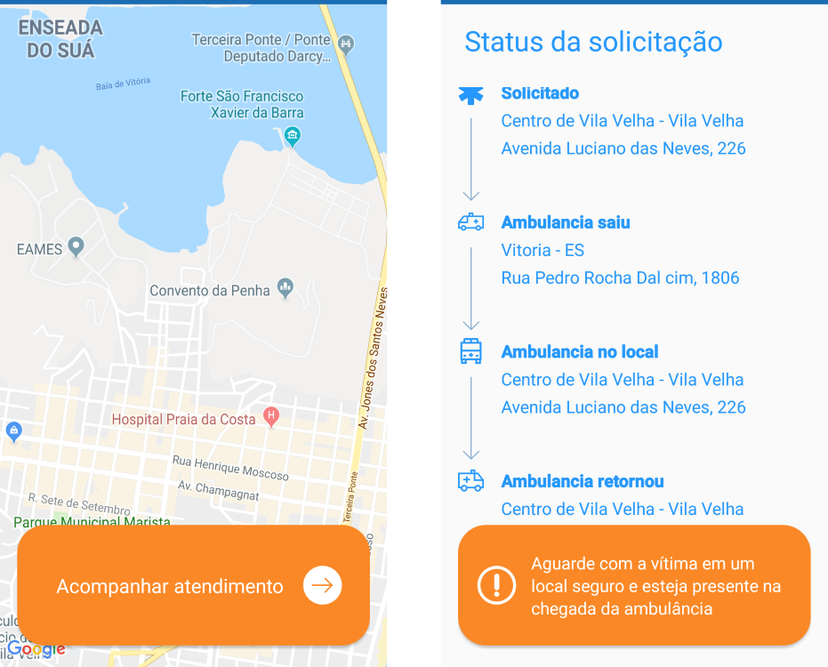
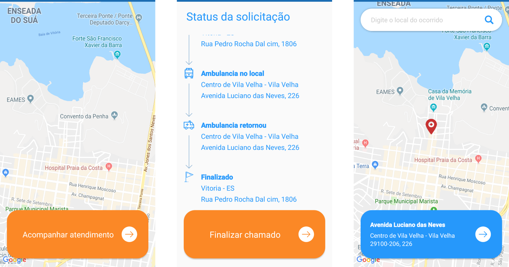
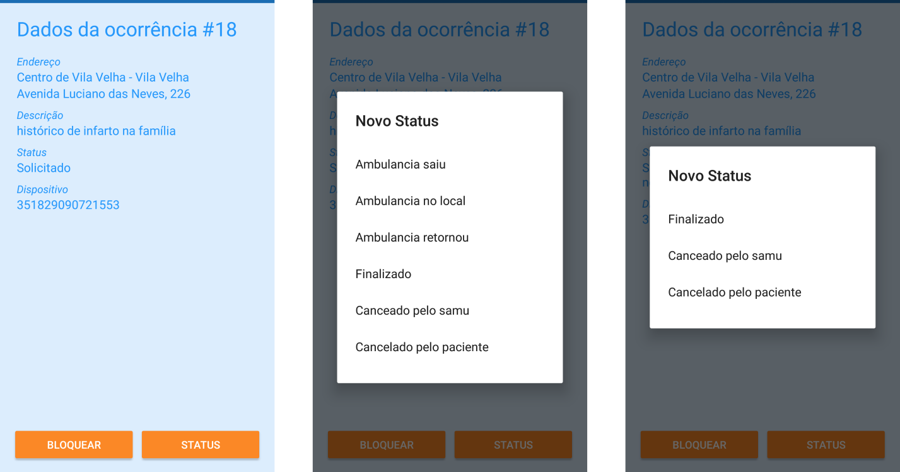

# SAMU
Está aplicação tem como objetivo aumentar a acessibilidade do deficiente auditivo aos principais serviços de atendimentos de urgência!

## Fluxos da aplicação
#### Abrir chamado para o SAMU

#### Fluxo quando houver atendimento pendente

#### Fluxo quando último atendimento pendente estiver finalizado

#### Mudança de status(apenas no aplicativo administrativo)

--------------------

### Development Tools
* Android Studio v3.1.4
* Android SDK Build Tools v28.0.0
* MinSdkVersion 21
* CompileSDKVersion 28
* Kotlin Version 1.2.70

--------------------

### Dependências
* Android Support Tools v28.0.0
* Koin 0.9.1
* Retrofit v2.4.0
* Glide v4.8.0
* Play Services(maps e location) v15.0.1
* Firebase messaging v16.0.3
* EventBus v3.1.1

--------------------

### Créditos
TODO: postar links para contato
* Product Owner: Aline Pacheco
* Designer: Jefferson Leutério
* WebService: Keoma Klein

